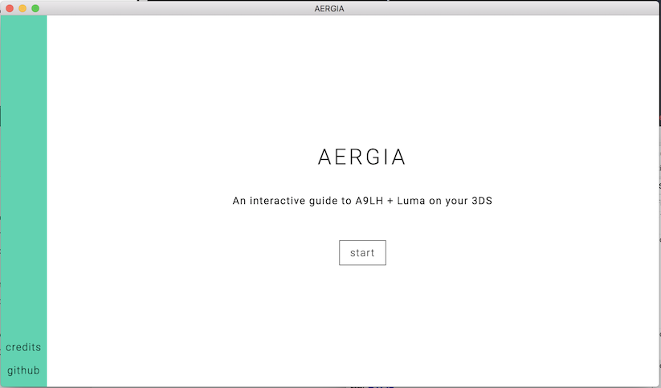
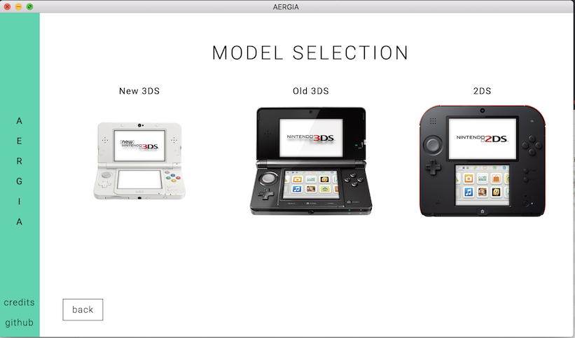
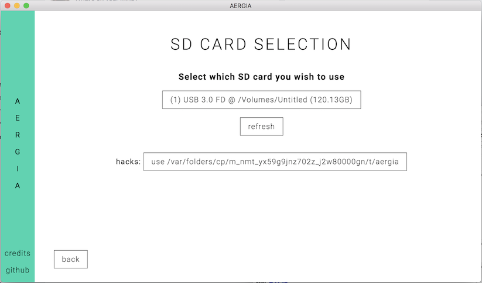
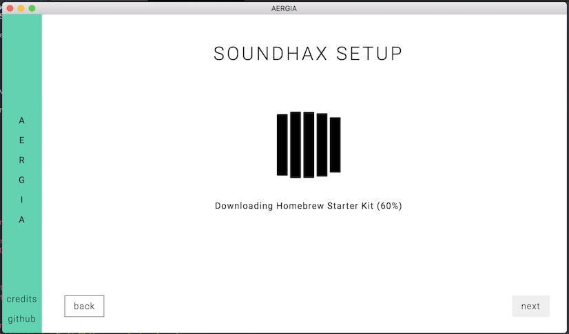
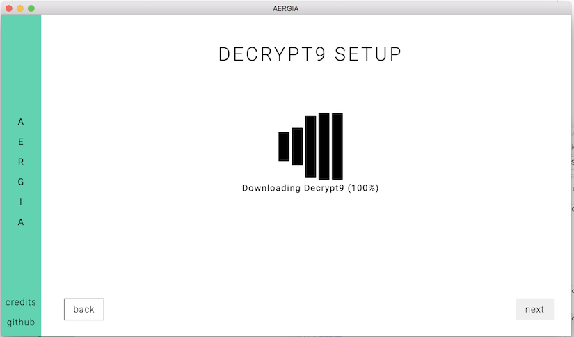

	
	 
	An interactive guide to A9LH + Luma on your 3DS

## What is it?

AERGIA is an electron application that is meant as both a guide, and an automator for installing A9LH onto your 3DS. It will guide you through steps, as well as automate the creation and setup of your (micro)SD card.

## WIP

This project is very much a work in progress. Styling and being pretty has come secondary to getting functionality working - although we would love your help in either case.

It currently supports selecting your device model, region, version. It then goes and downloads everything you need for soundhax, the homebrew launcher, decrypt9 and downgrading to 2.1

## Screenshots (Most likely outdated)

## Installation

Currently no prebuilt images are available as this is still very much WIP.

You can clone the repo, run `npm install` (or use `yarn`) and then run `npm run dev`

## TODOs

### Styling
- [x] branding
- [x] device images ???
- [x] flag/region images
- [ ] navigation foldout
- [ ] build proper grid elements
- [ ] UI elements and styling
- [ ] notification styling
- [ ] Style version select dropdown
- [ ] Fix image glitches/sizes
- [ ] Stop using hardcoded CSS everywhere?
- [ ] Fix layout on prompt (wifi/PG) and brick screens

### Functional
- [ ] Native app building
- [x] Model selection (+ selecting XL model for o3ds/n3ds)
- [x] Region selection
- [x] Version selection
- [x] Entrypoint detection based on model+region+version
- [ ] Support game-based primary entrypoints
- [x] Basic SD card selector
- [ ] Better SD card selector
- [x] Soundhax entrypoint file setup
- [ ] Soundhax entrypoint usage (before or after decrypt9+ctr screens?)
- [x] Decrypt9 setup
- [x] CTRTransfer firmware download
- [ ] Walkthrough for downgrading to 2.1 (+verify NAND dump?)
- [ ] A9LH step w/ file downloads
- [ ] Fix react components being still active when unmounted
- [ ] Injecting FBI + setup
- [ ] SD card cleanup
- [ ] "What next?"
- [ ] Credits page
